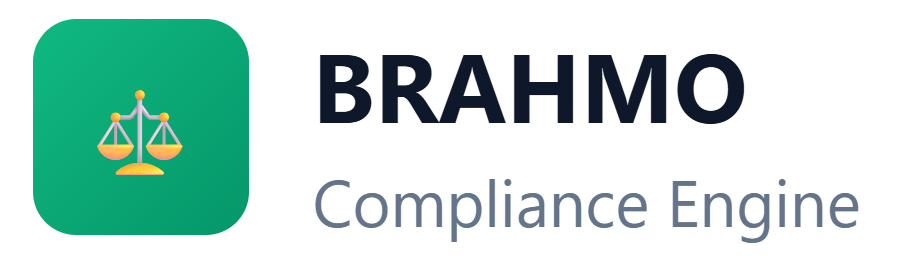

<p align="center">
  
</p>

<h1 align="center">⚖️ BRAHMO Compliance Engine</h1>

<p align="center">
  <strong>Backend Compliance Engine with Supabase RLS + audit system</strong>
</p>

<p align="center">
  
  
  
  
  
  
</p>

<p align="center">
  
  
  
  
</p>

---

## 🎯 System Design & JD Mapping

This project was specifically engineered to demonstrate robust backend and compliance capabilities:

| JD Requirement | Implementation in this Project |
|:---|:---|
| **FastAPI / Backend API** | **API Layer**: Secure backend endpoints (`/api/export`, `/api/review`) handling business logic and strict validation. |
| **Supabase / Postgres** | **Supabase RLS & Custom Tables**: Database-layer isolation through structured schemas (`matters`, `ai_sessions`). |
| **Auth System** | **Supabase Auth**: Secure JWT token validation, session management, and `app_metadata` role extraction. |
| **Audit Logs** | **BLOCKED_ACCESS Logging**: Immutable event tracing for unauthorized access attempts (`blocked_access_log`). |
| **Data Integrity** | **RLS Policies + Cryptographic Hashes**: Append-only constraints (no UPDATE/DELETE) coupled with Web Crypto SHA-256 output hashes. |
| **Secure Backend Design** | **Ethical Walls Concept**: Zero-trust architecture explicitly segregating client data via junction tables and RLS guardrails. |

---

## ✨ Features

<table>
<tr>
<td width="50%">

### 🔐 Ethical Walls (Data Segregation)
- **Database-Level Isolation**: Powered by PostgreSQL Row Level Security (RLS).
- **Strict Matter Access**: Associates can only view AI sessions and matters explicitly assigned to them.
- **Zero-Trust Backend**: Cross-matter queries are denied directly at the engine layer, preventing application-level bypasses.

</td>
<td width="50%">

### 🛡️ Immutable Audit Trail
- **Cryptographic Hashing**: Every AI session output is hashed (SHA-256) via the Web Crypto API before saving.
- **Tamper-Proof Logs**: RLS append-only policies (`GRANT INSERT`) explicitly prohibit `UPDATE` and `DELETE` on all audit logs.
- **Forensic Integrity**: Guarantees evidence cannot be retroactively modified, ensuring strict regulatory compliance.

</td>
</tr>
<tr>
<td width="50%">

### 👑 Partner Audit Powers
- **Role-Based Overrides**: Partners bypass standard matter constraints for global oversight.
- **Review Queue**: Partners can approve or reject associate AI interactions.
- **Breach Detection Dashboard**: Unauthorized access attempts by internal staff are intercepted and flagged for Partner review.

</td>
<td width="50%">

### 📥 Regulator-Ready Export
- **Anonymized Export**: Generates CSV reports with deterministically mapped client names (e.g., "Client A", "Client B") to protect attorney-client privilege.
- **Secure Backend Route**: Dynamic Next.js API endpoint that strictly enforces JWT bearer token validation.
- **Data Minimization**: Exports prove integrity via hashes without leaking raw output content.

</td>
</tr>
</table>

---

## 🖼️ Product Showcase

### 🎭 Role-Based Dashboard Views

The platform enforces strict UI & Data separation based on user role and assigned matters.

| User Role | View | Screenshot |
|:---:|:---:|:---:|
| **Partner (Sarah)** | Overview Dashboard |  |
| **Partner (Sarah)** | AI Session Review Queue |  |
| **Partner (Sarah)** | Blocked Access Logs |  |
| **Partner (Sarah)** | Immutable Audit Trail |  |
| **Partner (Sarah)** | Compliance CSV Export |  |
| **Associate (Priya)** | Assigned Matters |  |
| **Associate (Priya)** | AI Sessions |  |
| **Associate (Rahul)** | Assigned Matters |  |
| **Associate (Sonia)** | Overview |  |

---

## 🏛️ Architecture & System Design

### High-Level Component Diagram

```text
┌─────────────────────────────────────────────────────────────────────────┐
│                          NEXT.JS FRONTEND                                │
├──────────────────────────┬──────────────────────────────────────────────┤
│      UI Components       │             Security Handlers                 │
│  ┌──────────────────┐    │  ┌──────────────────────────────────────┐     │
│  │ Dashboard Panels │    │  │  Client-Side Role Guards             │     │
│  │ Review Queue UI  │────┼──│  Web Crypto API (SHA-256 Hashing)    │     │
│  │ CSV Export UI    │    │  │  JWT Token Management                │     │
│  └──────────────────┘    │  └──────────────────────────────────────┘     │
├──────────────────────────┴──────────────────────────────────────────────┤
│                         NEXT.JS API ROUTES                              │
│  ┌──────────────────────────────────────────────────────────────────┐   │
│  │  /api/export: Decodes JWT header, validates 'partner' role,      │   │
│  │               generates anonymized client CSV, forces dynamic.   │   │
│  │  /api/review: Validates 'partner' role, records decision.        │   │
│  └──────────────────────────────────────────────────────────────────┘   │
├─────────────────────────────────────────────────────────────────────────┤
│                     SUPABASE (POSTGRESQL 16)                            │
│  ┌──────────────────────────────────────────────────────────────────┐   │
│  │ 1. Ethical Walls: RLS `matter_permissions` checking JWT claims   │   │
│  │ 2. Audit Trail: `GRANT INSERT` only (Append-Only Log)            │   │
│  │ 3. Breach Log: `blocked_access_log` catches unauthorized queries │   │
│  └──────────────────────────────────────────────────────────────────┘   │
└─────────────────────────────────────────────────────────────────────────┘
```

### System Design Highlights

#### 1. Authorization Flow
```text
Request → JWT Extraction → Supabase RLS Evaluation 
  → If User == Partner: Grant Global SELECT 
  → If User == Associate: Join `matter_permissions` → Grant/Deny
```

#### 2. Immutable Hash Chain (Tamper-Proofing)
```text
AI Output → Client Browser (SubtleCrypto SHA-256) → Hash Generated
  → Sent to Supabase → RLS Enforces Append-Only (No Updates/Deletes)
```

#### 3. Data Export Anonymization
```text
Raw DB Pull → Map Client UUID to "Client A", "Client B"
  → Truncate User UUIDs → Strip Output Content → Generate CSV Stream
```

---

## 🔑 Role Access Matrix

| Feature | Partner 👑 | Associate / Paralegal 👤 |
|---------|:--------:|:---------:|
| View Assigned Matters & Sessions | ✅ | ✅ |
| Access Unassigned Matters | ❌ (Denied by RLS) | ❌ (Denied by RLS) |
| View Global Audit Trail | ✅ | ❌ |
| Approve / Reject AI Sessions | ✅ | ❌ |
| View Blocked Access Logs | ✅ | ❌ |
| Generate CSV Compliance Export | ✅ | ❌ |

---

## 🧪 Test Users

| Character | Email | Role | Accessible Matters | Password |
|-----------|-------|------|---------|----------|
| **Sarah** | sarah@brahmo.ai | `PARTNER` | ALL (Global Access) | Partner123! |
| **Priya** | priya@brahmo.ai | `ASSOCIATE` | Matter 1, Matter 2 | Associate123! |
| **Rahul** | rahul@brahmo.ai | `ASSOCIATE` | Matter 1, Matter 2, Matter 3 | Associate123! |
| **Sonia** | sonia@brahmo.ai | `ASSOCIATE` | Matter 1 | Associate123! |

*(Note: "Curious" associates attempting to view matters outside their scope trigger an immutable `no_permission` event in the Blocked Access Log).*

---

## 🚀 Quick Start

### 1. Local Development Setup

```bash
# Clone the repository
git clone <repo-url>
cd brahmo-compliance

# Install dependencies
npm install

# Copy environment file and add your Supabase credentials
cp .env.example .env.local

# Run the development server
npm run dev
```

### 2. Database Seeding
To set up the initial schema, RLS policies, and test data, run the provided SQL scripts against your Supabase project:
1. Execute `supabase/schema.sql` (Creates tables and RLS policies)
2. Execute `supabase/seed.sql` (Creates test users and matter permissions)

---

## 👨‍💻 Developed by

<div align="center">
  <a href="https://www.linkedin.com/in/sudheerkonduboina/">
    
  </a>
  <br/>
  <h3>Sudheer Konduboina</h3>
  <p>Software Engineer (Backend) & AI/ML Engineer</p>
  <a href="https://www.linkedin.com/in/sudheerkonduboina/">
    
  </a>
</div>

---

## © Copyright Notice

**© BRAHMO. All Rights Reserved.**
